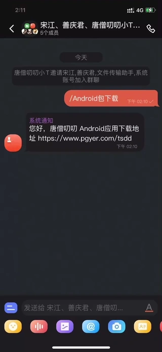
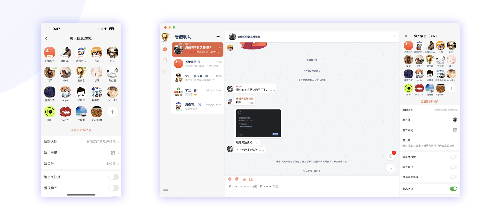
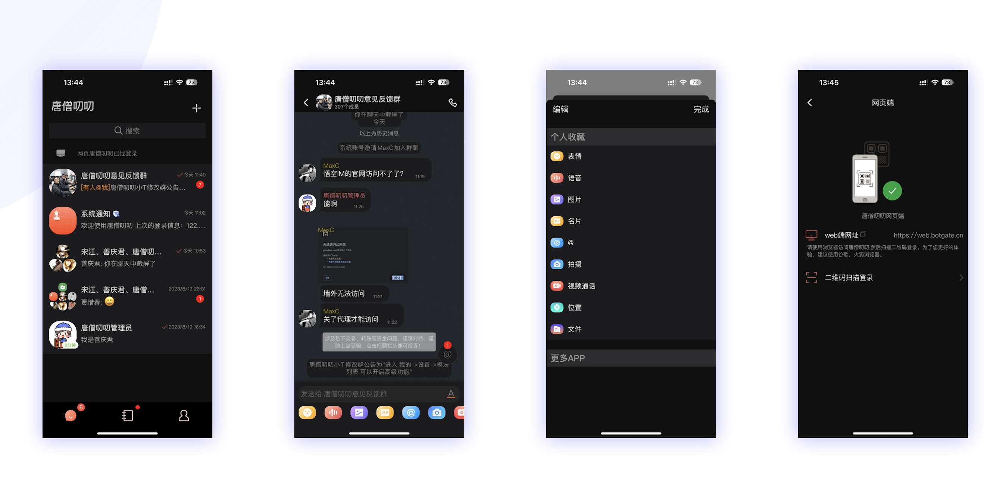
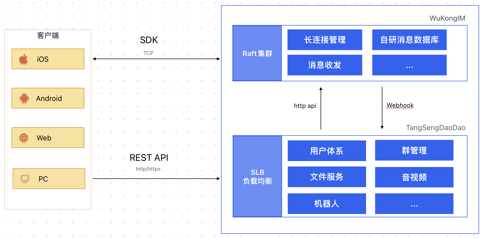

## 小龙虾

<!-- 开源社区第二屌(🦅)的即时通讯软件 -->

    几个老工匠，历时<a href="#">八年</a>时间打造的<a href="#">运营级别</a>的开源即时通讯聊天软件(<a href='https://github.com/WuKongIM/WuKongIM'>开源WuKongIM</a>提供通讯动力)

<!--  -->

 

<!--  -->

`开发环境需要go >=1.20`

愿景
------------

让企业轻松拥有自己的即时通讯软件。

动画演示
------------

||||
|:---:|:---:|:--:|
||||

|||          |
|:---:|:---:|:-------------------:|
|||  |

演示地址
------------

| Android扫描体验 | iOS扫描体验(商店版本 apple store 搜“小龙虾”) |
|:---:|:---:|
|||

| Web端 | Windows端 | MAC端 | Ubuntun端 |
|:---:|:---:|:---:|:---:|
|[点击体验](https://web.botgate.cn)|[点击下载](https://file.githubim.com/download/TangSengDaoDao-latest.exe) |[点击下载](https://file.githubim.com/download/TangSengDaoDao-latest.dmg)||

`app端在登录页面长按标题可以进入手机号登录`

演示账号：

| 账号 | 密码 |
|:---:|:---:|
| 15900000002 | a1234567 |
| 15900000003 | a1234567 |
| 15900000004 | a1234567 |
| 15900000005 | a1234567 |
| 15900000006 | a1234567 |

架构图
------------

采用大道至简的设计原则，我们尽最大的努力让架构简单化，让开发者上手成本和学习成本大大降低。

我们的架构设计原则：`简洁化`、`可扩展性`、`高可用`

整个系统分为二层：`通讯层`(WuKongIM)、`业务层`(TangSengDaoDao)

`通讯层`(WuKongIM)： 负责长连接维护，消息投递，消息高效存储等等

`业务层`(TangSengDaoDao)： 负责一些业务逻辑，比如：好友关系，群组，朋友圈等等，一些IM相关的业务层的逻辑

`通讯层与业务层`： WuKongIM会将一些业务层需要的聊天相关的数据通过Webhook的机制（GRPC）推送给TangSengDaoDao，TangSengDaoDao需要投递一些系统消息时，将调用WuKongIM的发送消息的API进行投递。

`客户端与服务端`： 客户端通过SDK与WuKongIM建立长连接，发送消息和收消息都将通过长连接进行传输，客户端的一些业务逻辑，比如：好友关系，群组，朋友圈等等，将通过调用TangSengDaoDao的API进行处理。

相关源码
------------

### 小龙虾（负责业务）

| 项目名 | Github地址 | Gitee地址 | 文档 | 说明 |
| ---- | ---------- | --------- | ---- | ---- |
|   TangSengDaoDaoServer   |   [Github](https://github.com/TangSengDaoDao/TangSengDaoDaoServer)         |     [Gitee](https://gitee.com/TangSengDaoDao/TangSengDaoDaoServer)  |  [文档](https://tsdaodao.com/dev/backend/deploy-compose.html)|    小龙虾的业务端，负责一些业务逻辑，比如：好友关系，群组，朋友圈等 （通讯端使用的是 WuKongIM）  |
|   TangSengDaoDaoAndroid   |   [Github](https://github.com/TangSengDaoDao/TangSengDaoDaoAndroid)         |     [Gitee](https://gitee.com/TangSengDaoDao/TangSengDaoDaoAndroid) | [文档](https://tsdaodao.com/dev/android/intro.html)    |    小龙虾的Android端   |
|   TangSengDaoDaoiOS   |   [Github](https://github.com/TangSengDaoDao/TangSengDaoDaoiOS)         |     [Gitee](https://gitee.com/TangSengDaoDao/TangSengDaoDaoiOS) | [文档](https://tsdaodao.com/dev/ios/intro.html)       |    小龙虾的iOS端   |
|   TangSengDaoDaoWeb   |   [Github](https://github.com/TangSengDaoDao/TangSengDaoDaoWeb)         |     [Gitee](https://gitee.com/TangSengDaoDao/TangSengDaoDaoWeb) | [文档](https://tsdaodao.com/dev/web/intro.html)       |    小龙虾的Web/PC端   |
|   TangSengDaoDaoManager   |   [Github](https://github.com/TangSengDaoDao/TangSengDaoDaoManager)         |     [Gitee](https://gitee.com/TangSengDaoDao/TangSengDaoDaoManager) | 无      |    小龙虾的后台管理系统  |

### 龙虾IM（负责通讯）

| 项目名 | Github地址 | Gitee地址 | 文档 | 说明 |
| ---- | ---------- | --------- | ---- |  ---- |
|   WuKongIM   |   [Github](https://github.com/WuKongIM/WuKongIM)         |     [Gitee](https://gitee.com/WuKongDev/WuKongIM) |  [文档](https://githubim.com/sdk/android.html)       |    龙虾IM通讯端，负责长连接维护，消息投递等等 |
|   WuKongIMAndroidSDK   |   [Github](https://github.com/WuKongIM/WuKongIMAndroidSDK)         |     [Gitee](https://gitee.com/WuKongDev/WuKongIMAndroidSDK) | [文档](https://githubim.com/sdk/android.html)    |    龙虾IM的Android SDK  |
|   WuKongIMiOSSDK   |   [Github](https://github.com/WuKongIM/WuKongIMiOSSDK)         |     [Gitee](https://gitee.com/WuKongDev/WuKongIMiOSSDK)  | [文档](https://githubim.com/sdk/ios.html)     |    龙虾IM的iOS SDK  |
|   WuKongIMUniappSDK   |   [Github](https://github.com/WuKongIM/WuKongIMUniappSDK)         |     [Gitee](https://gitee.com/WuKongDev/WuKongIMUniappSDK)  | [文档](https://githubim.com/sdk/uniapp.html)      |    龙虾IM的 Uniapp SDK  |
|   WuKongIMJSSDK   |   [Github](https://github.com/WuKongIM/WuKongIMJSSDK)         |     [Gitee](https://gitee.com/WuKongDev/WuKongIMJSSDK)   | [文档](https://githubim.com/sdk/javascript.html)     |    龙虾IM的 JS SDK  |
|   WuKongIMFlutterSDK   |    [Github](https://github.com/WuKongIM/WuKongIMFlutterSDK)        |    [Gitee](https://gitee.com/WuKongDev/WuKongIMFlutterSDK)   |[文档](https://githubim.com/sdk/flutter.html)    |    龙虾IM的 Flutter SDK |
|   WuKongIMReactNativeDemo   |   [Github](https://github.com/wengqianshan/WuKongIMReactNative)         |     无  |  无  |    龙虾IM的 React Native Demo(由贡献者 [wengqianshan](https://github.com/wengqianshan) 提供)  |

技术文档
------------

小龙虾：

https://tsdaodao.com

龙虾IM：

https://githubim.com

功能特性
------------
- [x] 全局特性
    - [x] 消息永久存储
    - [x] 消息加密传输
    - [x] 消息多端同步(app,web,pc等)
    - [x] 群聊人数无限制
    - [x] 机器人
- [x] 消息列表
    - [x] 单聊
    - [x] 群聊
    - [x] 发起群聊
    - [x] 添加朋友
    - [x] 扫一扫
    - [x] 列表提醒项，比如消息@提醒，待办提醒，服务器可控
    - [x] 置顶
    - [x] 消息免打扰
    - [x] web登录状态显示
    - [x] 消息搜索
    - [x] 消息输入中
    - [x] 消息未读数
    - [x] 用户标识
    - [x] 无网提示
    - [x] 草稿提醒
- [x] 消息详情
    - [x] 文本消息
    - [x] 图片消息
    - [x] 语音消息
    - [x] Gif消息
    - [x] 合并转发消息
    - [x] 正在输入消息
    - [x] 自定义消息
    - [x] 撤回消息
    - [x] 群系统消息
    - [x] 群@消息
    - [x] 消息回复
    - [x] 消息转发
    - [x] 消息收藏
    - [x] 消息删除
- [x] 群功能
    - [x] 添加群成员/移除群成员
    - [x] 群成员列表
    - [x] 群名称
    - [x] 群二维码
    - [x] 群公告
    - [x] 保存到通讯录
    - [x] 我在本群昵称
    - [x] 群投诉    
    - [x] 清空群聊天记录    
- [x] 好友
    - [x] 备注
    - [x] 拉黑
    - [x] 投诉
    - [x] 添加/解除好友
- [x] 通讯录
    - [x] 新的朋友
    - [x] 保存的群
    - [x] 联系人列表
- [x] 我的
    - [x] 个人信息
    - [x] 新消息通知设置
    - [x] 安全与隐私
    - [x] 通用设置
    - [x] 聊天背景
    - [x] 多语言
    - [x] 黑暗模式
    - [x] 设备管理

Star
------------

我们团队一直致力于即时通讯的研发，需要您的鼓励，如果您觉得本项目对您有帮助，欢迎点个star，您的支持是我们最大的动力。

加入群聊
------------

微信：加群请备注“小龙虾”

许可证
------------

小龙虾 使用 Apache 2.0 许可证。有关详情，请参阅 LICENSE 文件。

